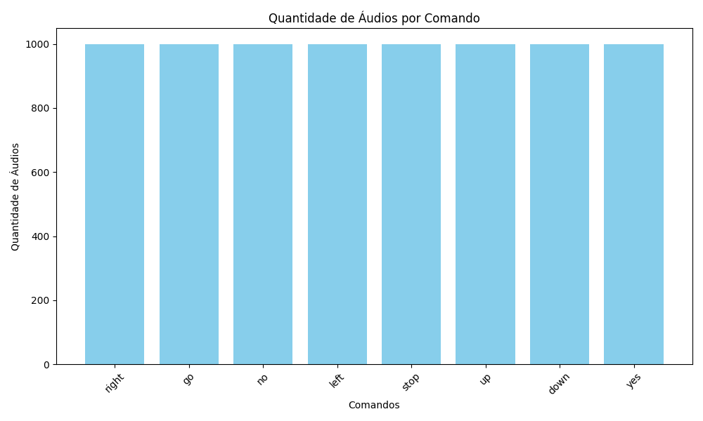
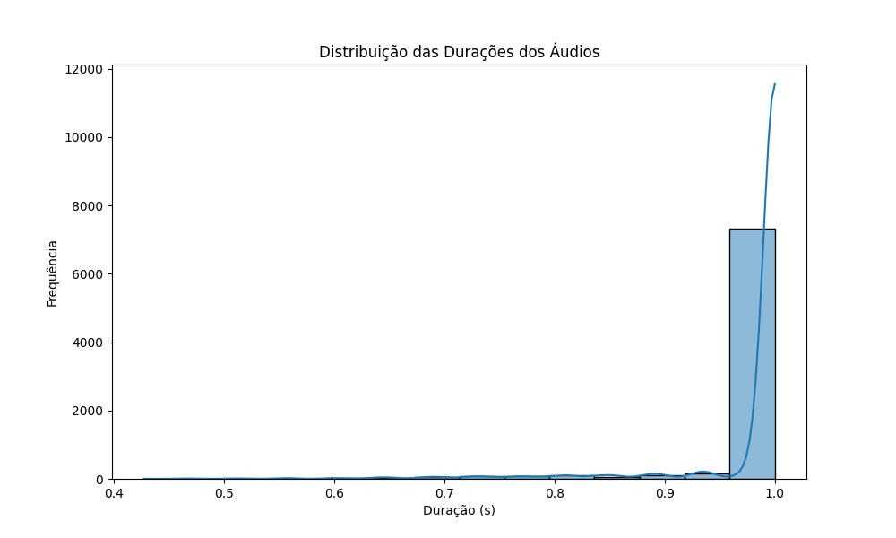
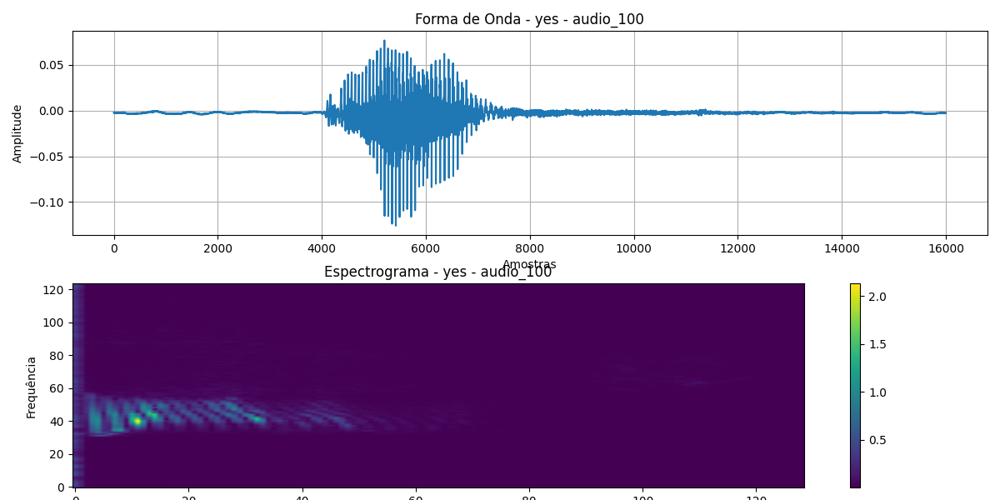
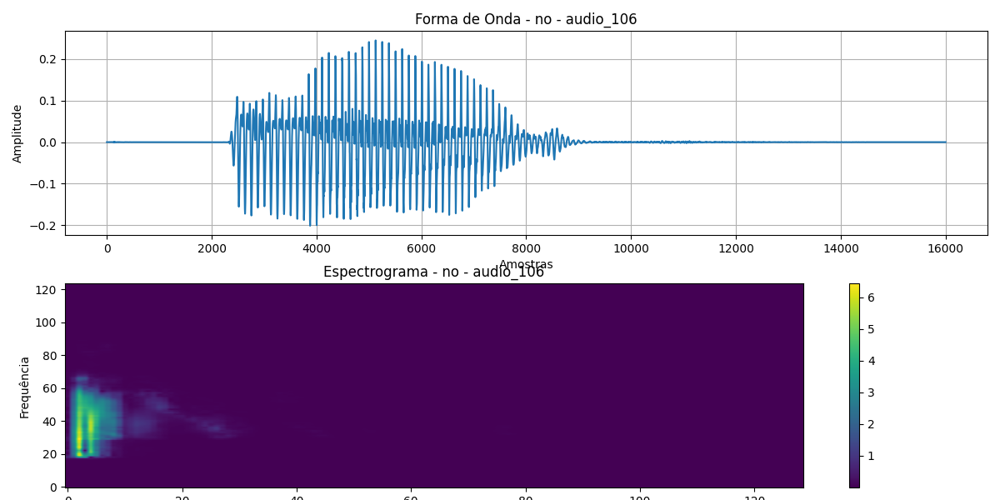
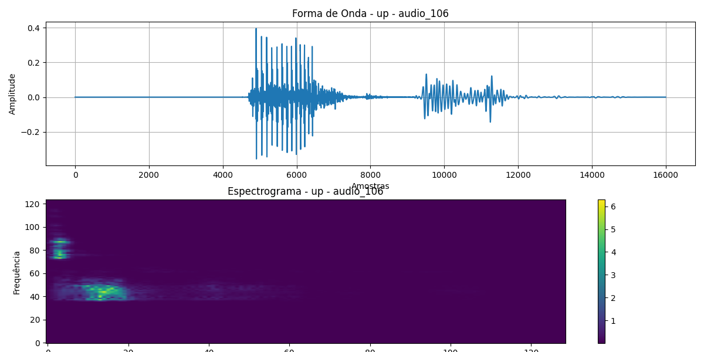

# Análise de Dados

## Sumário

## Sumário
- [Descrição do Projeto](#descrição-do-projeto)
- [Arquivos e Funções](#arquivos-e-funções)
- [Pré-processamento do Áudio](#pré-processamento-do-áudio)
- [Análise Descritiva](#análise-descritiva)
  - [Quantidade de Áudios por Comando](#quantidade-de-áudios-por-comando)
  - [Distribuição das Durações dos Áudios](#distribuição-das-durações-dos-áudios)
  - [Exemplos de Espectrogramas](#exemplos-de-espectrogramas)
- [Como Executar o Projeto](#como-executar-o-projeto)
- [Requisitos](#requisitos)
- [Estrutura de Diretórios](#estrutura-de-diretórios)

## Descrição do Projeto

O projeto realiza uma análise descritiva e visual do conjunto de dados **Mini Speech Commands**, o qual contém gravações de comandos de voz em formato `.wav`. A análise inclui o pré-processamento dos dados, a visualização de formas de onda e espectrogramas, e a verificação da distribuição das durações dos áudios. Essa investigação é um passo inicial para a criação de um modelo de aprendizado de máquina que classifique comandos de voz a partir dos dados de áudio.


## Arquivos e Funções

### [main.py](https://github.com/FabioHenriqueFarias/Projeto-de-IA-e-AD/blob/main/Analise%20De%20Dados/src/main.py)

O `main.py` é o ponto de entrada do projeto, responsável por integrar todas as partes do fluxo de trabalho. As suas principais responsabilidades incluem:
- **Download e extração do conjunto de dados:** Invoca a função que baixa e extrai o dataset `mini_speech_commands` caso não esteja presente.
- **Carregamento de comandos:** Obtém a lista de comandos de voz disponíveis no dataset.
- **Carregamento das formas de onda:** Carrega os arquivos de áudio e converte-os em formas de onda.
- **Análise das durações dos áudios:** Gera um gráfico que ilustra a distribuição da duração dos áudios para cada comando.
- **Geração de representações gráficas:** Executa a função que gera gráficos de forma de onda e espectrogramas para todos os comandos de áudio.
- **Análises descritivas:** Realiza a contagem e visualização da quantidade de áudios por comando, bem como a visualização das formas de onda de amostras.

### [data_loading.py](https://github.com/FabioHenriqueFarias/Projeto-de-IA-e-AD/blob/main/Analise%20De%20Dados/src/data_loading.py)

Este módulo é responsável pela gestão do conjunto de dados, incluindo download, listagem e análise. Suas principais funções incluem:
- **`download_and_extract_data()`**: Baixa e extrai o conjunto de dados `mini_speech_commands`, garantindo que os dados estejam disponíveis para uso.
  - **Retorno:** O caminho do diretório onde o conjunto de dados foi extraído.
  
- **`list_commands()`**: Fornece uma lista dos comandos de voz disponíveis no dataset.
  - **Retorno:** Um array contendo os nomes dos comandos de voz.

- **`explore_durations(commands)`**: Analisa e gera um gráfico da distribuição das durações dos áudios para cada comando, ajudando a entender a variabilidade no dataset.
  - **Parâmetro:** 
    - `commands (list)`: Lista dos comandos de áudio a serem analisados.
  - **Salva:** O gráfico da distribuição em `out/data_loading/duracao_audios.png`.

- **`load_waveforms()`**: Carrega os arquivos de áudio e os converte em formas de onda, retornando um dicionário que relaciona cada comando com suas formas de onda correspondentes.
  - **Retorno:** Um dicionário com os nomes dos comandos como chaves e listas de formas de onda (arrays) como valores.

### [audio_representation.py](https://github.com/FabioHenriqueFarias/Projeto-de-IA-e-AD/blob/main/Analise%20De%20Dados/src/audio_representation.py)

Este módulo é responsável por criar representações gráficas dos áudios, oferecendo uma visualização clara dos dados. As funções incluem:
- **`plot_waveform(waveform, title="Forma de Onda")`**: Plota a forma de onda do áudio fornecido, facilitando a visualização da amplitude ao longo do tempo.
  
- **`plot_spectrogram(waveform, title="Espectrograma")`**: Gera e plota o espectrograma do áudio utilizando a Transformada de Fourier de Curto Prazo (STFT), representando as frequências em função do tempo.

- **`plot_waveform_and_spectrogram(waveform, command_name, audio_file_name)`**: Cria e salva gráficos de forma de onda e espectrograma para um áudio específico, organizando os gráficos em diretórios correspondentes aos comandos.
  - **Parâmetros:**
    - `waveform (np.array)`: A forma de onda do áudio.
    - `command_name (str)`: O nome do comando correspondente.
    - `audio_file_name (str)`: O nome do arquivo de áudio, utilizado para salvar os gráficos.

- **`generate_example_plots(file_path)`**: Gera e salva gráficos de forma de onda e espectrograma para um arquivo de áudio específico, servindo como exemplo de visualização.

- **`generate_all_plots(waveforms)`**: Itera sobre todas as formas de onda no dataset e gera gráficos de forma de onda e espectrograma para cada um, salvando-os em seus respectivos diretórios.

### [analysis_descriptive.py](https://github.com/FabioHenriqueFarias/Projeto-de-IA-e-AD/blob/main/Analise%20De%20Dados/src/analysis_descriptive.py)

Este módulo realiza análises descritivas do conjunto de dados, oferecendo insights quantitativos. As funções incluem:
- **`analyze_audio_commands()`**: Conta e plota a quantidade de áudios disponíveis para cada comando, proporcionando uma visão geral da distribuição do dataset.
  
- **`plot_audio_samples(waveforms)`**: Plota formas de onda de amostras de áudio para cada comando, permitindo uma comparação visual direta entre os diferentes comandos e suas amostras.


## Pré-processamento do Áudio

Os arquivos de áudio são convertidos para o formato `.wav` para garantir compatibilidade e qualidade nos processamentos subsequentes. Essa etapa é crucial, pois formatos de áudio diferentes podem ter compressões e codificações que afetam a análise de dados.

## Análise Descritiva

### Quantidade de Áudios por Comando

A função `analyze_audio_commands()` gera um gráfico de barras da quantidade de áudios por comando, permitindo visualizar a distribuição dos dados. Essa análise é importante para entender quais comandos possuem mais amostras e quais podem estar sub-representados.



### Distribuição das Durações dos Áudios

A função `explore_durations()` cria um histograma com a duração dos áudios, proporcionando uma visão clara da variabilidade das amostras. Isso ajuda a identificar se existem comandos que tendem a ser mais longos ou mais curtos, o que pode influenciar o desempenho dos modelos de classificação.



## Análise de Espectrogramas

Os espectrogramas são representações visuais da amplitude do sinal de áudio em função do tempo e da frequência. Essa análise é fundamental para entender como as diferentes frequências se comportam ao longo do tempo em cada comando de voz. 

### Importância dos Espectrogramas

Os espectrogramas permitem identificar padrões de frequência que são característicos de cada comando, oferecendo insights sobre a articulação e entonação vocal. Esses padrões podem ser utilizados para melhorar a acurácia na classificação dos comandos de voz em modelos de aprendizado de máquina.

### Exemplos de Espectrogramas

Abaixo estão exemplos de espectrogramas gerados para comandos de voz, que ilustram as diferentes características sonoras:







Esses espectrogramas ilustram como a energia do sinal varia ao longo do tempo e das frequências, permitindo a identificação de harmônicos, ruídos e outros elementos sonoros que podem ser cruciais para a classificação precisa dos comandos de voz. Para explorar mais espectrogramas, acesse o diretório [out/audio_representation](https://github.com/FabioHenriqueFarias/Projeto-de-IA-e-AD/tree/main/Analise%20De%20Dados/src/out/audio_representation), onde você encontrará representações visuais para cada comando específico. Basta selecionar o comando desejado, indicado como `[#comando]`, para visualizar os espectrogramas correspondentes.

## Como Executar o Projeto

1. Clone o repositório:
    ```bash
    git clone https://github.com/FabioHenriqueFarias/Projeto-de-IA-e-AD.git
    cd Projeto-de-IA-e-AD
    ```
2. Instale as dependências:
    ```bash
    pip install -r requirements.txt
    ```
3. Execute o arquivo principal:
    ```bash
    python src/main.py
    ```

## Requisitos

- Python 3.7 ou superior
- Bibliotecas: `tensorflow`, `matplotlib`, `numpy`

## Estrutura de Diretórios

```plaintext
Projeto-de-IA-e-AD/
│
├── src/
│   ├── main.py                    # Script principal
│   ├── data_loading.py             # Módulo de download e carregamento de dados
│   ├── audio_representation.py     # Módulo para visualização de dados
│   ├── analysis_descriptive.py     # Módulo para análise descritiva
│
└── out/                            # Saída dos gráficos gerados
    ├── data_loading/
    ├── analysis_descriptive/
    └── audio_representation/
```