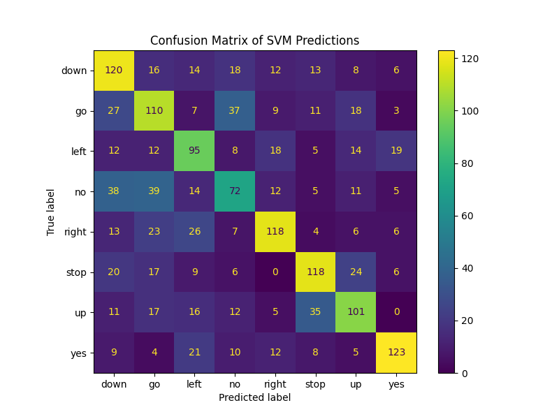
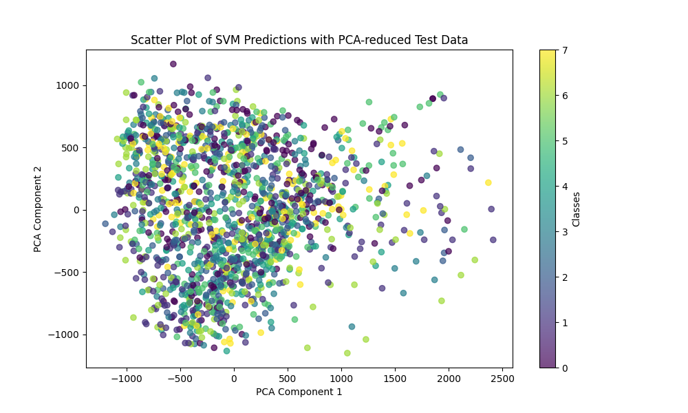

# Voice Command Classification with Support Vector Machine (SVM)

Este projeto visa a construção e avaliação de um modelo de aprendizado de máquina para o reconhecimento de comandos de voz. O processo envolve o pré-processamento dos dados de áudio, treinamento de um modelo de Máquina de Vetores de Suporte (SVM) para classificação de espectrogramas de áudio e a avaliação do modelo utilizando um conjunto de dados de teste.

## Sumário

- [Descrição do Projeto](#descrição-do-projeto)
- [Arquivos e Funções](#arquivos-e-funções)
  - [data_processing.py](#data_processingpy)
  - [main.py](#mainpy)
- [Pré-processamento de Dados](#pré-processamento-de-dados)
- [Treinamento do Modelo](#treinamento-do-modelo)
- [Avaliação do Modelo](#avaliação-do-modelo)
- [Como Executar o Projeto](#como-executar-o-projeto)
- [Resultados de Avaliação](#resultados-de-avaliação)
  - [Matriz de Confusão](#matriz-de-confusão)
  - [Gráfico de Dispersão](#gráfico-de-dispersão)
- [Requisitos](#requisitos)

## Descrição do Projeto

Este projeto tem como objetivo treinar e avaliar um modelo de **Máquina de Vetores de Suporte (SVM)** para a classificação de comandos de voz, usando espectrogramas extraídos de gravações de áudio. O objetivo principal é criar um modelo capaz de classificar comandos de voz simples, como "up", "down", "left", "right", "yes", "no", "go" e "stop". O modelo SVM é treinado com espectrogramas log-mel, que são representações visuais do áudio em termos de suas frequências e amplitudes ao longo do tempo.

## Arquivos e Funções

### data_processing.py

Contém funções para pré-processar os arquivos de áudio, convertendo-os em espectrogramas log-mel.

- **`preprocess_audio(file_path, target_sr=16000)`**: Converte o arquivo de áudio em um espectrograma log-mel.
- **`process_all_commands()`**: Processa todos os comandos de voz e salva seus espectrogramas correspondentes em arquivos `.npy`.

### main.py

Executa o fluxo principal do projeto, incluindo o carregamento dos dados, treinamento do modelo SVM, avaliação do modelo e geração de gráficos.

- **`load_data()`**: Carrega os dados de áudio pré-processados (espectrogramas) e seus rótulos.
- **`train_model()`**: Treina o modelo SVM com os dados de treinamento.
- **`evaluate_model()`**: Avalia o modelo SVM no conjunto de teste e gera relatórios de avaliação.
- **`generate_plots()`**: Gera e salva a matriz de confusão e o gráfico de dispersão.

## Pré-processamento de Dados

O pré-processamento dos dados envolve a conversão dos arquivos de áudio em espectrogramas log-mel, que são então usados como entradas para o modelo SVM. O processo garante que todos os espectrogramas tenham o mesmo tamanho (128x128 pixels) para uniformidade no treinamento.

## Treinamento do Modelo

O treinamento do modelo é realizado utilizando um **SVM (Máquina de Vetores de Suporte)**. O modelo é treinado com os espectrogramas log-mel extraídos dos arquivos de áudio e é avaliado usando um conjunto de dados de teste para medir sua precisão e outros indicadores de performance, como precisão (precision), recall e F1-score.

## Avaliação do Modelo

A avaliação do modelo é feita utilizando um conjunto de dados de avaliação que é processado da mesma forma que os dados de treinamento. Após o treinamento, o modelo SVM é testado e os resultados são apresentados nas seguintes formas:

- **Relatório de classificação**: Exibe precisão, recall e F1-score para cada classe de comando de voz.
- **Matriz de Confusão**: Visualiza o desempenho do modelo em cada classe, indicando onde ele acerta ou comete erros.
- **Gráfico de Dispersão**: Visualiza a distribuição das previsões e ajuda a entender a separabilidade das classes.

## Resultados de Avaliação

Após a execução do script `main.py`, obtemos os seguintes resultados:

### Acurácia
- **53.56%**

### Relatório de Classificação

| Comando | Precision | Recall | F1-Score | Suporte |
| ------- | --------- | ------ | -------- | ------- |
| down    | 0.48      | 0.58   | 0.53     | 207     |
| go      | 0.46      | 0.50   | 0.48     | 222     |
| left    | 0.47      | 0.52   | 0.49     | 183     |
| no      | 0.42      | 0.37   | 0.39     | 196     |
| right   | 0.63      | 0.58   | 0.61     | 203     |
| stop    | 0.59      | 0.59   | 0.59     | 200     |
| up      | 0.54      | 0.51   | 0.53     | 197     |
| yes     | 0.73      | 0.64   | 0.68     | 192     |

- **Média Macro:** Precisão: 0.54 | Recall: 0.54 | F1-score: 0.54
- **Média Ponderada:** Precisão: 0.54 | Recall: 0.54 | F1-score: 0.54

### Matriz de Confusão

A matriz de confusão ajuda a visualizar o desempenho do modelo, mostrando onde ele acerta ou confunde os comandos. As linhas representam os comandos reais, enquanto as colunas representam as previsões feitas pelo modelo. Valores altos na diagonal principal indicam boas predições, enquanto valores fora da diagonal indicam confusões entre comandos. Este insight é essencial para identificar padrões de erro, que podem guiar futuras melhorias no modelo.



### Gráfico de Dispersão

O gráfico de dispersão, gerado através de uma análise de componentes principais (PCA), reduz a dimensionalidade dos dados de avaliação para permitir uma visualização mais clara das relações entre os comandos. No gráfico, cada ponto representa uma previsão de comando, e as cores distintas correspondem a diferentes classes. Este gráfico permite observar clusters de comandos corretamente classificados e eventuais sobreposições, indicando onde o modelo pode ter dificuldades em distinguir comandos similares.



## Como Executar o Projeto

1. **Clone o repositório**:
    ```bash
    git clone https://github.com/FabioHenriqueFarias/Projeto-de-IA-e-AD.git
    cd Projeto-de-IA-e-AD
    ```
2. **Instale as dependências**:
    ```bash
    pip install -r requirements.txt
    ```
3. **Execute o pré-processamento dos dados**:
    ```bash
    python main.py
    ```
    Isso irá processar os arquivos de áudio e salvar os espectrogramas.
4. **Treine o modelo**:
    ```bash
    python main.py
    ```

## Requisitos

Este projeto exige o Python 3.x e as seguintes dependências:

- numpy
- librosa
- scikit-learn
- matplotlib

Instale as dependências com o comando:

```bash
pip install -r requirements.txt
```
