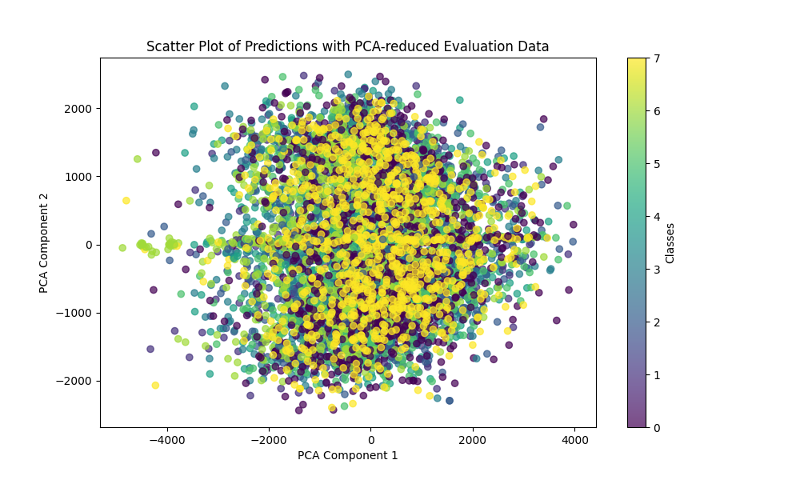

# Voice Command Classification Project with Convolutional neural network 

Este projeto visa a construção e avaliação de um modelo de aprendizado de máquina para reconhecimento de comandos de voz. O processo envolve o pré-processamento dos dados de áudio, treinamento de um modelo convolucional para classificação de espectrogramas de áudio e a avaliação do modelo utilizando um conjunto de dados de teste.

## Sumário
- [Descrição do Projeto](#descrição-do-projeto)
- [Arquivos e Funções](#arquivos-e-funções)
  - [model.py](#modelpy)
  - [evaluation.py](#evaluationpy)
  - [training.py](#trainingpy)
  - [data_preprocessing.py](#data_preprocessingpy)
  - [main.py](#mainpy)
- [Pré-processamento de Dados](#pré-processamento-de-dados)
- [Treinamento do Modelo](#treinamento-do-modelo)
- [Avaliação do Modelo](#avaliação-do-modelo)
- [Como Executar o Projeto](#como-executar-o-projeto)
- [Como Usar `evaluation.py`](#como-usar-evaluationpy)
- [Resultados de Avaliação](#resultados-de-avaliação)
  - [Matriz de Confusão](#matriz-de-confusão)
  - [Gráfico de Dispersão](#gráfico-de-dispersão)
- [Requisitos](#requisitos)

## Descrição do Projeto

Este projeto tem como objetivo treinar e avaliar um modelo de rede neural convolucional (CNN) para a classificação de comandos de voz, usando espectrogramas extraídos de gravações de áudio. O objetivo principal é criar um modelo capaz de classificar comandos de voz simples, como "up", "down", "left", "right", "yes", "no", "go" e "stop". O modelo é treinado utilizando espectrogramas log-mel, que são representações visuais do áudio em termos de suas frequências e amplitudes ao longo do tempo.

## Arquivos e Funções

### model.py

Define a arquitetura do modelo de rede neural convolucional (CNN) para classificação dos comandos de voz.

- **`create_model(input_shape=(128, 128, 1), num_classes=8)`**: Cria e compila um modelo CNN.

### evaluation.py

Carrega o modelo treinado e avalia sua performance utilizando um conjunto de dados de teste, gerando um relatório de classificação e uma matriz de confusão.

- **`load_trained_model(model_path="speech_command_model.h5")`**: Carrega o modelo treinado.
- **`load_eval_data(eval_data_path="data/assessment/")`**: Carrega os dados de avaliação, processando os arquivos de áudio em espectrogramas.
- **`evaluate_model(model, x_eval, y_eval)`**: Avalia o modelo carregado e exibe o relatório de classificação e matriz de confusão.

### training.py

Carrega os dados, divide-os em conjuntos de treinamento e validação e treina o modelo CNN. Após o treinamento, o modelo é salvo para posterior avaliação.

- **`load_data(data_dir="data/processed")`**: Carrega os dados processados (espectrogramas) para treinamento.
- **`train_model(epochs=10, batch_size=32)`**: Treina o modelo utilizando os dados carregados.

### data_preprocessing.py

Contém as funções para pré-processar os arquivos de áudio, convertendo-os em espectrogramas log-mel.

- **`preprocess_audio(file_path, target_sr=16000)`**: Converte o arquivo de áudio em um espectrograma log-mel.
- **`process_all_commands()`**: Processa todos os comandos de voz e salva seus espectrogramas correspondentes.

### main.py

Orquestra as principais etapas do projeto, permitindo executar o pré-processamento dos dados, criar o modelo CNN e treinar o modelo.

## Pré-processamento de Dados

O pré-processamento dos dados envolve a conversão dos arquivos de áudio em espectrogramas log-mel, que são então usados para treinamento e avaliação do modelo.

## Treinamento do Modelo

O treinamento do modelo é realizado utilizando uma rede neural convolucional (CNN), dividindo os dados em conjuntos de treinamento e validação, e salvando o modelo após o treinamento.

## Avaliação do Modelo

A avaliação do modelo é feita utilizando um conjunto de dados de avaliação, que é processado de forma similar ao conjunto de treinamento (convertido em espectrogramas). Os resultados incluem:

- **Relatório de classificação**: Exibe precisão, recall e F1-score para cada classe de comando de voz.
- **Matriz de confusão**: Visualiza o desempenho do modelo em cada classe.

## Como Executar o Projeto

1. **Clone o repositório**:
    ```bash
    git clone https://github.com/FabioHenriqueFarias/Projeto-de-IA-e-AD.git
    cd Projeto-de-IA-e-AD
    ```
2. **Instale as dependências**:
    ```bash
    pip install -r requirements.txt
    ```
3. **Execute o pré-processamento dos dados**:
    ```bash
    python main.py
    ```
    Isso irá processar os arquivos de áudio e salvar os espectrogramas.
4. **Treine o modelo** (caso queira treinar após o pré-processamento):
    ```bash
    python main.py
    ```

## Como Usar `evaluation.py`

1. **Prepare os Dados de Avaliação**  
   Verifique que os dados de avaliação estão organizados corretamente e prontos para uso.

2. **Carregue o Modelo Treinado**  
   Certifique-se de que o modelo treinado está salvo no diretório especificado.

3. **Execute a Avaliação**:
    ```bash
    python src/evaluation.py
    ```

## Resultados de Avaliação

Após a execução do script `evaluation.py`, obtivemos os seguintes resultados:

### Acurácia
- **88.45%**

### Relatório de Classificação
| Comando | Precision | Recall | F1-Score | Suporte |
| ------- | --------- | ------ | -------- | ------- |
| down    | 0.82      | 0.93   | 0.87     | 1000    |
| go      | 0.90      | 0.67   | 0.77     | 1000    |
| left    | 0.92      | 0.91   | 0.91     | 1000    |
| no      | 0.80      | 0.85   | 0.83     | 1000    |
| right   | 0.89      | 0.94   | 0.91     | 1000    |
| stop    | 0.95      | 0.93   | 0.94     | 1000    |
| up      | 0.88      | 0.91   | 0.89     | 1000    |
| yes     | 0.94      | 0.94   | 0.94     | 1000    |

- **Média Macro:** Precisão: 0.89 | Recall: 0.88 | F1-score: 0.88
- **Média Ponderada:** Precisão: 0.89 | Recall: 0.88 | F1-score: 0.88

### Matriz de Confusão

A matriz de confusão ajuda a visualizar o desempenho do modelo, mostrando onde ele acerta ou confunde os comandos. As linhas representam os comandos reais, enquanto as colunas representam as previsões feitas pelo modelo. Valores altos na diagonal principal indicam boas predições, enquanto valores fora da diagonal indicam confusões entre comandos. Este insight é essencial para identificar padrões de erro, que podem guiar futuras melhorias no modelo.


### Gráfico de Dispersão

O gráfico de dispersão, gerado através de uma análise de componentes principais (PCA), reduz a dimensionalidade dos dados de avaliação para permitir uma visualização mais clara das relações entre os comandos. No gráfico, cada ponto representa uma previsão de comando, e as cores distintas correspondem a diferentes classes. Este gráfico permite observar clusters de comandos corretamente classificados e eventuais sobreposições, indicando onde o modelo pode ter dificuldades em distinguir comandos similares.



## Requisitos

Este projeto exige o Python 3.x e as seguintes dependências:

- numpy
- librosa
- tensorflow
- scikit-learn
- matplotlib

Instale as dependências com o comando:

```bash
pip install -r requirements.txt
```

