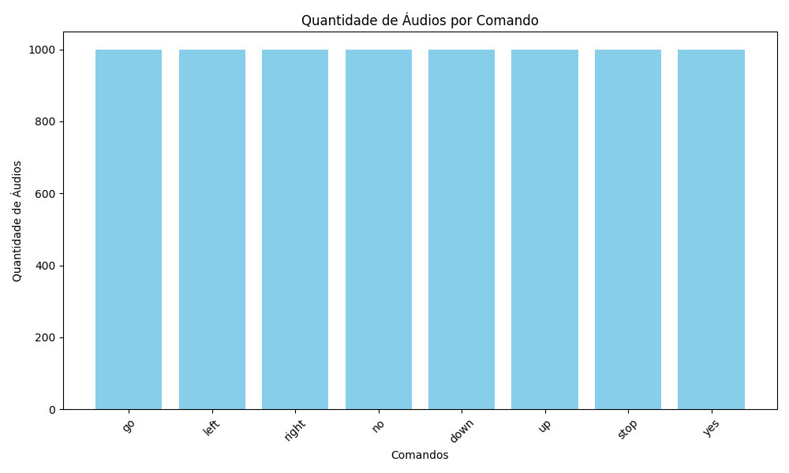
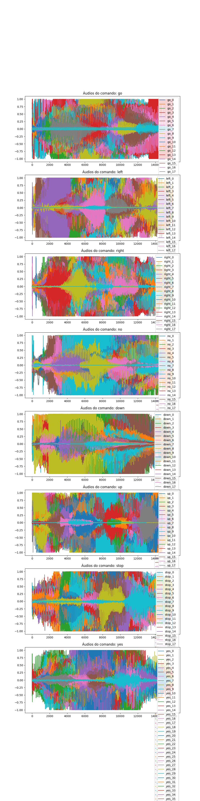
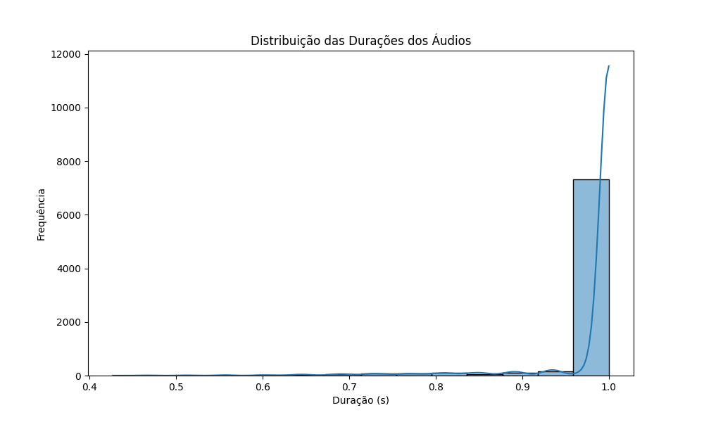
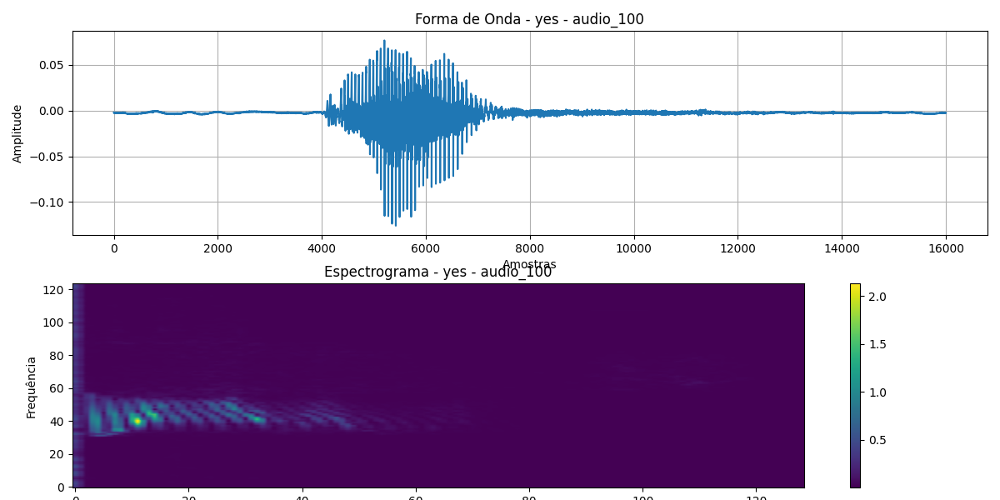
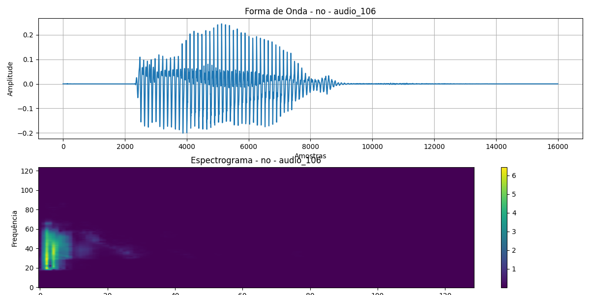
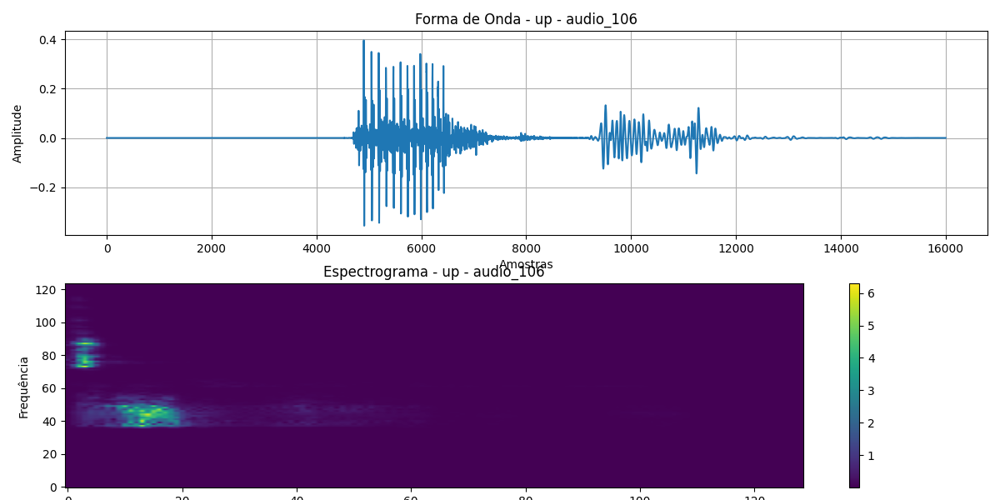

# Projeto de Classificação de Comandos de Voz com TensorFlow

## Sumário

- [Introdução](#introdução)
- [Estrutura de Arquivos](#estrutura-de-arquivos)
- [Descrição dos Arquivos e Funções](#descrição-dos-arquivos-e-funções)
    - [main.py](#mainpy)
    - [data_loading.py](#data_loadingpy)
    - [audio_representation.py](#audio_representationpy)
    - [model_training.py](#model_trainingpy)
    - [.py](#model_trainingpy)
    - [analysis.py](#analysispy)
- [Execução](#execução)
    - [Pré-requisitos](#pré-requisitos)
    - [Como Executar o Projeto](#como-executar-o-projeto)
- [Análise de Dados](#análise-de-dados)
    - [Análise Descritiva](#análise-descritiva)
        - [1. Quantidade de Áudios por Comando](#1-quantidade-de-áudios-por-comando)
        - [2. Amostras de Áudio](#2-amostras-de-áudio)
    - [Distribuição das Durações dos Áudios](#distribuição-das-durações-dos-áudios)
    - [Representação dos Áudios em Espectrogramas](#representação-dos-áudios-em-espectrograma)
        - [Exemplos de Espectrogramas](#exemplos-de-espectrogramas)

## Introdução

Este projeto tem como objetivo desenvolver um modelo de aprendizado de máquina para classificar comandos de voz usando o dataset Mini Speech Commands. Através de uma abordagem comparativa, o projeto avalia a eficiência de duas representações de áudio: formas de onda e espectrogramas. Ao final, esperamos contribuir com uma melhor compreensão sobre o impacto das representações de áudio no desempenho de modelos de classificação.

## Estrutura de Arquivos

- **main.py**: Arquivo principal do projeto. Executa o fluxo completo, desde o carregamento dos dados até a análise dos resultados do modelo.
- **data_loading.py**: Contém funções para baixar, extrair, explorar e listar o dataset de comandos de voz. Responsável por carregar e preparar os dados para o treinamento.
- **audio_representation.py**: Contém funções para visualização e análise dos áudios, incluindo o plot das formas de onda e espectrogramas para inspeção dos dados de áudio.
- **model_training.py**: Define e treina os modelos de classificação de áudio. Este arquivo contém funções para pré-processamento dos dados, criação da arquitetura da rede neural e treino dos modelos.
- **analysis.py**: Realiza análise de desempenho dos modelos, incluindo gráficos de precisão e teste t para comparar a performance dos modelos com diferentes representações de áudio.

## Descrição dos Arquivos e Funções

### main.py

O arquivo `main.py` integra todas as etapas do projeto, executando funções de cada módulo de maneira sequencial:
1. **Carregamento e Exploração dos Dados**: Utiliza `data_loading.download_and_extract_data` para garantir que o dataset esteja disponível e `data_loading.explore_durations` para visualizar a distribuição das durações dos áudios.
2. **Visualização de Exemplos**: Chama `audio_representation.generate_example_plots` para gerar gráficos das formas de onda e espectrogramas dos áudios.
3. **Treinamento dos Modelos**: Configura e treina modelos para as duas representações de áudio.
4. **Análise de Resultados**: Utiliza funções de `analysis.py` para avaliar o desempenho dos modelos e compará-los estatisticamente.

### data_loading.py

Contém funções para o download e carregamento dos dados:
- **download_and_extract_data()**: Baixa e extrai o dataset Mini Speech Commands se ainda não estiver disponível no diretório `data/mini_speech_commands_extracted`.
- **list_commands()**: Lista os comandos de voz disponíveis no dataset.
- **explore_durations(commands)**: Analisa a distribuição das durações dos áudios em segundos e salva um gráfico dessa distribuição em `out/duracao_audios.png`.

### audio_representation.py

Módulo para visualizar diferentes representações de áudio:
- **plot_waveform(waveform, title)**: Plota a forma de onda de um áudio.
- **plot_spectrogram(waveform, title)**: Gera e exibe o espectrograma de um áudio.
- **generate_example_plots(file_path)**: Gera e salva os gráficos de forma de onda e espectrograma de um arquivo de áudio específico, salvo como `out/example_plots.png`.

### model_training.py

Contém a configuração e o treinamento dos modelos:
- **preprocess_audio(audio)**: Converte o áudio em um espectrograma usando STFT (Short-Time Fourier Transform), adequado para entrada na rede neural.
- **create_model(input_shape)**: Define a arquitetura do modelo de rede neural convolucional (CNN) e configura suas camadas.
- **train_model(model, X_train, y_train, X_val, y_val, epochs)**: Treina o modelo com os dados de treino e validação, retornando o histórico de treino para posterior análise.

### analysis_descriptive.py'

- **analyze_audio_commands()**: Conta a quantidade de áudios disponíveis para cada comando e gera um gráfico de barras para visualização, salvando a imagem na pasta de saída apropriada.
- **plot_audio_samples()**: Carrega e plota as formas de onda dos áudios para cada comando, exibindo uma visualização clara dos diferentes áudios disponíveis.

### analysis.py'

Contém funções para análise e visualização do desempenho dos modelos:
- **plot_model_performance(history)**: Plota a acurácia do modelo ao longo das épocas de treinamento.
- **compare_accuracies(accuracy_waveform, accuracy_spectrogram)**: Realiza um teste t para comparar as acurácias dos modelos com diferentes representações de áudio, determinando se a diferença é estatisticamente significativa.

## Execução

Siga os passos descritos para garantir que todas as dependências estejam corretamente instaladas e que o código funcione como esperado.

### Pré-requisitos

- Python 3.7 ou superior
- TensorFlow
- NumPy
- Matplotlib
- Seaborn
- SciPy

Instale os pacotes com:

```bash
pip install -r requirements.txt
```

### Como Executar o Projeto

1. Certifique-se de que todos os pacotes necessários estão instalados.
2. Execute `main.py` para iniciar o fluxo completo do projeto:

    ```bash
    python main.py
    ```

## Análise de Dados 

### Análise Descritiva

A seção de Análise Descritiva fornece uma visão geral dos dados de áudio presentes no conjunto de dados de comandos de voz. As funções implementadas realizam a contagem dos áudios por comando e geram representações visuais desses dados.

#### 1. Quantidade de Áudios por Comando

A função `analyze_audio_commands()` contabiliza a quantidade de arquivos de áudio disponíveis para cada comando e gera um gráfico de barras para visualização. O gráfico fornece uma rápida compreensão de quais comandos têm mais ou menos áudios disponíveis, o que pode influenciar o treinamento do modelo.

- **Gráfico da Quantidade de Áudios por Comando**:



O gráfico acima mostra a quantidade de áudios disponíveis para cada comando. Essa informação é fundamental para entender a distribuição dos dados e sua adequação para o treinamento do modelo.

#### 2. Amostras de Áudio

A função `plot_audio_samples()` plota as formas de onda dos áudios para cada comando, permitindo uma análise visual das características dos sinais de áudio. Essa visualização é útil para verificar a qualidade e as variações nos dados de áudio.

- **Gráfico das Amostras de Áudio**:



No gráfico acima, cada subplot representa um comando, e as diferentes linhas correspondem às formas de onda dos áudios associados a esse comando. Esta visualização ajuda a identificar padrões e variações nos dados de áudio, que são essenciais para o desenvolvimento e treinamento de modelos de aprendizado de máquina.

### Distribuição das Durações dos Áudios

O primeiro passo na análise foi visualizar a distribuição das durações dos áudios presentes no dataset Mini Speech Commands. A figura abaixo mostra a distribuição das durações dos áudios em segundos:



Essa visualização é fundamental para entender a variabilidade dos dados e pode influenciar diretamente as estratégias de treinamento dos modelos. Notamos que a maioria dos áudios se concentra em torno de 1.0 segundo, o que pode impactar a eficácia do modelo de classificação. Essa concentração sugere que o modelo pode se beneficiar de técnicas específicas de pré-processamento e otimização, ajustando suas configurações para lidar melhor com essa faixa de duração predominante. Compreender essa distribuição é essencial para garantir que o modelo generalize adequadamente em dados não vistos.

### Representação dos Áudios em Espectrograma

Além das formas de onda, o projeto também gera espectrogramas para cada comando de áudio, permitindo uma análise mais detalhada das características temporais e de frequência dos sinais. Os espectrogramas são salvos em subdiretórios específicos dentro do diretório `out/audio_representation`, organizados por comando.

#### Exemplos de Espectrogramas

Aqui estão algumas imagens de espectrogramas gerados para diferentes comandos:

- **Comando "yes"**


- **Comando "no"**


- **Comando "up"**


Esses espectrogramas ajudam a visualizar como os diferentes comandos se comportam em termos de frequência ao longo do tempo, oferecendo insights valiosos para o desenvolvimento do modelo de classificação. A análise dessas representações é crucial para entender como as informações sonoras estão codificadas e como isso pode afetar o desempenho do modelo.